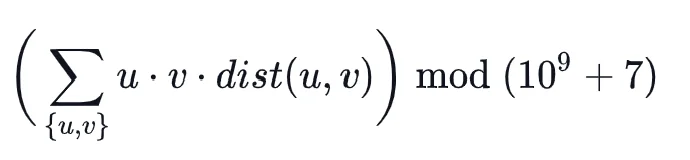

# Kitty's Calculations on a Tree

## Problem
https://www.hackerrank.com/challenges/kittys-calculations-on-a-tree/problem?h_r=profile

## Doubling or Eurler Tour is not enough
I tried to solve this problem using LCA by Doubling (solution_doubling.py) or LCA by Euler Tour with Sparse Tree (solution_euler.py). The complexity of Doubling and Euler Tour is as follows:
- Doubling:
    - Preprocessing: $O(NlogN)$
    - Query: $O(logN)$
- Euler Tour with Sparse Tree:
    - Preprocessing: $O(N)$ + $O(NlogN)$
    - Query: $O(1)$

But both ended up with a timeout. Why? In this problem, we have a lot of queries to solve. There are Q query sets and each query set has K nodes. The order of Q and K is the same as that of N (number of nodes). And the required query is as follows:



If you solve this naively, there are $O(K^2)$ iterations. So, even if each query costs O(1), the whole query costs $O(Q) \cdot O(K^2)$. This is equivalent to $O(N^3)$. So, we need to somehow reduce the complexity of the query to $O(N^2)$ or less. 

## Solution
In the problem, $u$, $v$ are only subset of the tree contained in the query set. However, in the following discussion, we assume that all the nodes are contained in the query set.

Let us start with a simple case of 2 nodes.

$$    x  $$

$$ a \quad /  \quad \backslash \quad b $$

$$ / \quad \quad \backslash $$

$$ u \quad \quad \quad v $$

We can decompose $u \cdot v \cdot dist(u, v)$ into the sum of each node's contribution as follows:

$$ a = dist(u, x) $$

$$ b = dist(v, x) $$

$$ T = u \cdot a + v \cdot b $$

$$ S = u \cdot v \cdot dist(u, v) $$

$$ = u \cdot v \cdot (a + b) $$

$$ \quad \quad \quad \quad \quad \quad \quad = (T - u \cdot a) \cdot u + (T - v \cdot b) \cdot v $$


Generalizing this, we get this for multiple nodes sharing the same LCA:

$$ x \quad --- $$

$$ d_1 / \quad \backslash d_2 \quad ... \quad \backslash d_k $$

$$ \quad / \quad \quad \backslash \quad \quad ... \quad \backslash \quad $$

$$ u_1 \quad \quad \quad u_2 \quad ... \quad u_k $$

$$ d_i = dist(u_i, x) $$

$$ T = \sum_{i=1}^{k} u_i \cdot d_i $$

$$ S = \sum_{i, j} u_i \cdot u_j \cdot dist(u_i, u_j) $$

$$ = \sum_{i, j} u_i \cdot u_j \cdot (d_i + d_j) $$

$$ = \sum_{i=1}^{k} (T - u_i \cdot d_i) \cdot u_i $$

This takes only $2k$ iterations. ($k$ to get $T$, and another $k$ to get the final result.) But what happens if there are different LCAs? Let us add a node $z$ whose LCA with $u_i$ is $y$.

$$ \quad y --- $$

$$ \quad \quad e / \quad \quad \quad \quad \backslash f $$

$$ \quad \quad / \quad \quad \quad \quad \quad \backslash $$

$$ \quad \quad x \quad ---- \quad z $$

$$ d_1 / \quad \backslash d_2 \quad ... \quad \backslash d_k $$

$$ \quad / \quad \quad \backslash \quad \quad ... \quad \backslash \quad $$

$$ u_1 \quad \quad \quad u_2 \quad ... \quad u_k $$

Let

$$ T' = \sum_{i=1}^{k} [u_i \cdot (d_i + e)] + z \cdot f $$

$$ = T + \sum_i u_i \cdot e + z \cdot f $$

Then,

$$ S' = \sum_{i, j} u_i \cdot u_j \cdot dist(u_i, u_j) + \sum_i u_i \cdot z \cdot (d_i + e + f) $$

$$ = S + \sum_i u_i \cdot z \cdot (d_i + e + f) $$

$$ = S + z \cdot \sum_i u_i \cdot (d_i + e) + z \cdot f \cdot \sum_i u_i $$

$$ = S + (T' - z \cdot f) \cdot z + (T' - T - e \cdot \sum u_i) \cdot \sum u_i \$$

$$ = S + [T' - (T + \sum_i u_i \cdot e)] \cdot \sum_i u_i + (T' - z \cdot f) \cdot z $$

And let us denote

$$ V_x = \sum_i u_i, T_x = T $$

$$ V_z = z, T_z = 0 $$

We get

$$ T' = (T_x + V_x \cdot e) + (T_z + V_z \cdot f) $$

$$ \Delta S = S' - S $$

$$ = [T' - (T_x + V_x \cdot e)] \cdot V_x + [T' - (T_z + V_z \cdot f)]\ \cdot V_z $$

From tihs we can guess the following:
1. Each leaf node has its V and T as follows:
    - $V = [node \, value], \; T = 0$
2. For a LCA of leaf nodes
    - We can get $\Delta S$:
        - $T = \sum T_{u_i} + V_{u_i} \cdot d_i$
        - $\Delta S = \sum [T - (T_{u_i} + V_{u_i} \cdot d_i)] \cdot V_{u_i} $
    - We can convert this node to a leaf node with
        - $V = \sum V_{u_i}, \; T = \sum T_{u_i} + V_{u_i} \cdot d_i$
3. For an LCA of leaf nodes or converted leaf nodes, we can do the same as in 2.

I will skip the proof (just a conversion of expressions), but actually we can do the above for any tree. So, by traversing the tree from leaf nodes to the root with the above calculation, we can calculate $S$ for the whole tree.

## Optimization
I got a timeout error for some test cases in Hackerrank when naively implementing the above algorithm. This may be because Python is slow or does not support parallel processing, but I was able to avoid timeouts by tweaking the code as follows.

In the function [`process_queries()`](https://github.com/tada3/hackerrank/blob/main/Kitty_Calc_Tree/python/solution.py#L57), I put the states of the current node and its child nodes for all the query sets into the dictionary `workplace`, and then set the updated states of the current node to the dictionary `post_processed`. And here, I pick up the node that has the largest states (has states for more query sets), and set its states to `post_processed`. If states exists only in `post_processed`, we do not need to process for that query set. This allows us to reduce the number of iterations especially when the number of query sets is large.

## How to run
```
% python3 solution.py < testcase_0.txt
```

